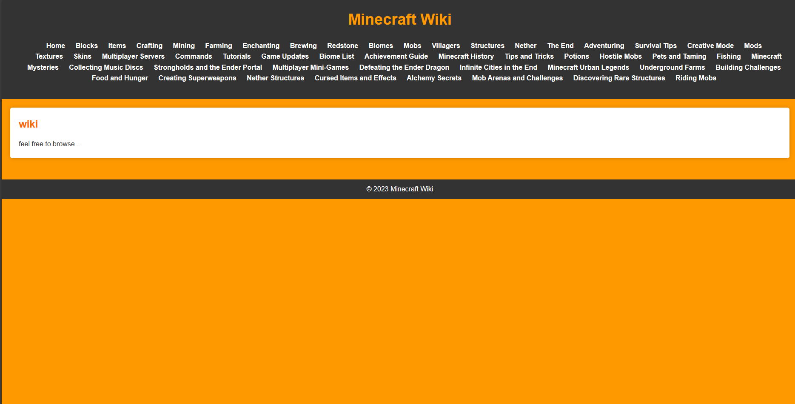

```markdown
# mcwiki

[](https://opensource.org/licenses/MIT)

**mcwiki** is a simple offline mini-Minecraft wiki designed to provide quick and easy access to essential Minecraft information. Whether you're a new player looking for guidance or a seasoned veteran in need of a reference, **mcwiki** has got you covered.

## Features

- Easy navigation with a user-friendly interface.
- Detailed information on blocks, items, crafting, mobs, biomes, and more.
- Comprehensive guides on various aspects of Minecraft gameplay.
- Offline access, ensuring you have vital information even without an internet connection.

## Installation

To use **mcwiki**, simply download the repository and open the `index.html` file in your preferred web browser. There's no need for an internet connection; all the information you need is right at your fingertips.

```bash
git clone https://github.com/thatdudejr/mcwiki.git
cd mcwiki
```

## Usage

- Launch the `index.html` file in your web browser.
- Use the navigation menu to explore different categories of Minecraft information.
- Find the answers to your questions and enhance your Minecraft experience.

## Contributing

Contributions are welcome! If you'd like to add or update content, fix bugs, or improve the user interface, please follow these steps:

1. Fork the repository.
2. Create a new branch for your feature or bug fix.
3. Make your changes.
4. Test your changes to ensure they work as expected.
5. Submit a pull request.

## License

This project is licensed under the MIT License - see the [LICENSE](LICENSE) file for details.

## Acknowledgments

- **mcwiki** is built using HTML, CSS, and JavaScript.
- Special thanks to the Minecraft community for their valuable contributions and knowledge.

Happy Gaming LOL!


```

